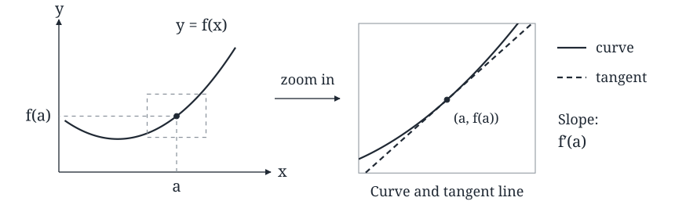
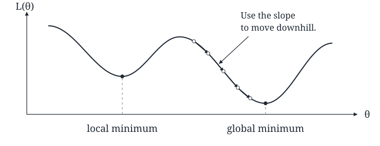

::: {.source-note}
[Lecture PDF · September 23, 2026](../downloads/september-23-course-introduction.pdf)
:::

**Before we begin:** Syllabus, course outline, and questions.

## What is calculus?

Calculus gives us a way to study change. In this course, we focus on *differential calculus*: how functions behave locally, very close to a point. The main idea is that a smooth curve looks nearly straight when we zoom in. The slope of that local line, the *tangent line*, is the derivative $f'(a)$.

{fig-alt="A curve y equals f of x with the point (a, f(a)) marked. A magnified view shows the curve nearly coinciding with its dashed tangent line. The tangent slope is f prime of a." width=860}

For motion, this is the difference between *average velocity* over a time interval and *instantaneous velocity* at one moment. Limits will let us make the idea of “very close” precise.

## How was calculus invented?

Newton and Leibniz independently developed calculus, building on earlier work. Their questions about tangents, areas, and motion became a common mathematical language. A few dates give the story some shape:

- **1664–1666.** Isaac Newton studies mathematics intensively at Cambridge, then develops the foundations of calculus during the plague years. The **1665** outbreak keeps him at Woolsthorpe for much of this period; he records basic calculus rules in **1666** but does not publish them immediately. [\[1\]](#ref-newton)
- **1684.** Gottfried Wilhelm Leibniz publishes his first paper on differential calculus. Much of our notation, including $dx$ and $dy$, comes from him. [\[2\]](#ref-leibniz)
- **1684–1687.** Edmond Halley asks Newton about planetary motion in 1684. His questions and encouragement help lead to Newton's *Principia* in **1687**; Halley also pays for its publication. [\[1\]](#ref-newton)
- **1705 and 1758.** Halley uses Newton's theory to predict a comet's return in 1758. It returns as predicted. Halley's comet last returned in **1986** and is expected again in **2061**. [\[3\]](#ref-halley)

The point is that mathematics can do more than describe what we see: it can predict what happens next.

## How do we use calculus?

### Differential equations

These are equations involving rates of change. For an object of constant mass moving along a line, Newton's law becomes

$$
F=ma=m\frac{d^2x}{dt^2}.
$$

Here $x(t)$ is position, its first derivative is velocity, and its second derivative is acceleration. A law about forces becomes a model of motion.

### Optimization

Say we have a model with a parameter $\theta$ and a loss function $L(\theta)$ that measures how poorly it fits the data. We want to find a value of $\theta$ with small loss.

{fig-alt="A loss curve with two valleys. The left valley is a local minimum; the lower right valley is the global minimum. Arrows show successive downhill moves into the lower valley." width=780}

*Idea:* Use slopes of tangent lines to find extrema. How do we find a minimum without seeing the whole graph?

**Gradient descent** follows the downhill direction in small steps, an idea found in Cauchy's **1847** paper. [\[4\]](#ref-cauchy) It can settle in a local minimum and slow down where the graph is flat. Think of a ball moving down a landscape: the valley it reaches depends on where it starts.

**Adam** (adaptive moment estimation), introduced by Kingma and Ba in **2014**, uses running estimates of gradients and their squares to adjust the steps. [\[5\]](#ref-adam) It connects this same slope idea to training machine learning models; it does not guarantee the lowest valley.

## What will we learn about calculus?

*Course overview from the September 23, 2026 lecture (Math 1334, Seattle University).*

| When | Topic |
|:--|:--|
| Weeks 1–3 | **Limits:** making “very close” precise. |
| Weeks 4–6 | **Derivatives:** measuring local rates of change. |
| Weeks 7–10 | **Applications:** using derivatives to solve problems. |
| Week 11 | **Final preparation:** putting the ideas together. |

## References for the historical dates

::: {#ref-newton}
1. The Newton Project, University of Oxford. [*The Life and Work of Isaac Newton at a Glance*.](https://newtonproject.ox.ac.uk/his-life-and-work-at-a-glance)
:::

::: {#ref-leibniz}
2. G. W. Leibniz (1684). [*Nova methodus pro maximis & minimis*.](https://digitalcollections.hkust.edu.hk/Detail/objects/b540295) *Acta eruditorum*, 467–473. HKUST Library digitization.
:::

::: {#ref-halley}
3. NASA Science. [*1P/Halley*.](https://science.nasa.gov/solar-system/comets/1p-halley/)
:::

::: {#ref-cauchy}
4. A.-L. Cauchy (1847). [*Méthode générale pour la résolution des systèmes d'équations simultanées*.](https://www.gtfp.cs.rhul.ac.uk/pulskamp/Cauchy/Orbits/1847%20CR%20536%28383%29.pdf) *Comptes rendus* 25, 536–538. English translation by R. J. Pulskamp.
:::

::: {#ref-adam}
5. D. P. Kingma and J. Ba (2014). [*Adam: A Method for Stochastic Optimization*.](https://arxiv.org/abs/1412.6980) arXiv:1412.6980; presented at ICLR 2015.
:::
