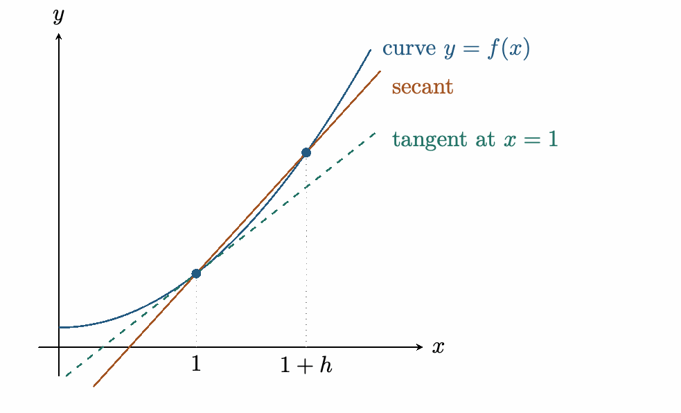
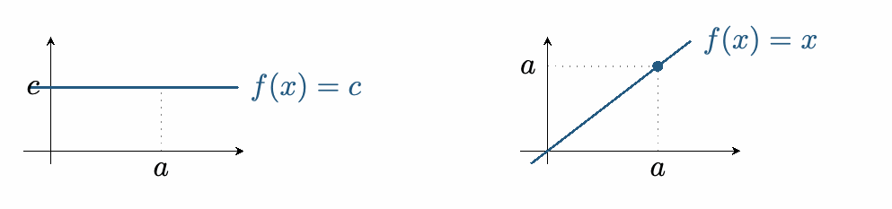
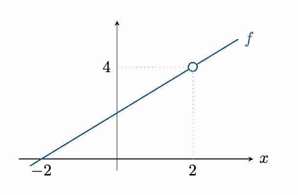
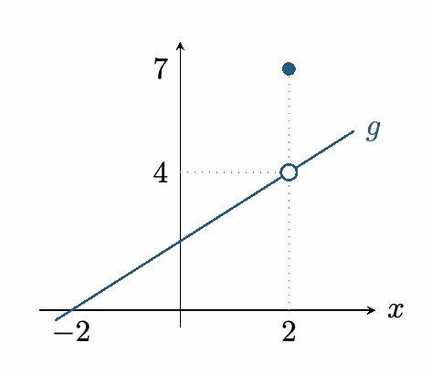
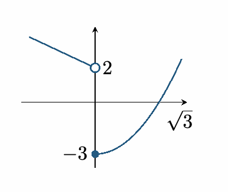
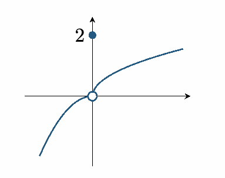
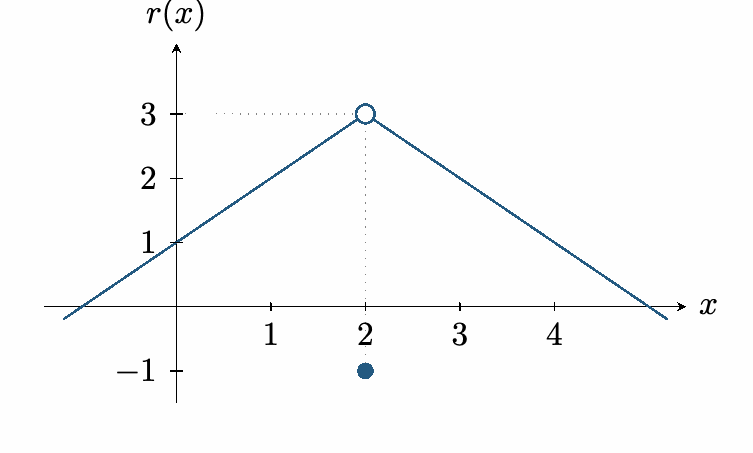

::: {.source-note}
[Lecture PDF · September 28, 2026](../downloads/september-28-limits-class-notes.pdf)
:::

**Goal.** Compute slopes of tangent lines.

A *secant line* passes through two points on the graph. Its slope is the average rate of change. A *tangent line* gives the instantaneous rate of change at a point (instantaneous velocity for a position function).

{fig-alt="A secant joins two points on a curve; the tangent touches the curve at the first point." width=502}

Secant slope:

$$
\frac{f(1+h)-f(1)}{h},\qquad h\ne0.
$$

More generally, the *difference quotient* is

$$
\frac{f(a+h)-f(a)}{h}.
$$

As $h\to0$, the second point approaches the first. We study limits to describe what the secant slope approaches.

::: {.statement}

**Definition.** We say $f$ is *defined near $a$* if it is defined on some open interval containing $a$, except possibly at $a$. For example, $(x^2-1)/(x-1)$ is defined near $1$, although it is undefined at $1$.

:::

::: {.statement}

**Definition (informal).** We write $\displaystyle\lim_{x\to a}f(x)=L$ if the values of $f(x)$ can be made arbitrarily close to $L$ by taking *all* $x$ sufficiently close to $a$, with $x\ne a$. We also write $f(x)\to L$ as $x\to a$. If no such real number $L$ exists, the finite limit does not exist (DNE).

:::

::: {.statement}

**Theorem.** For real constants $a$ and $c$,

$$
\lim_{x\to a}c=c,\qquad \lim_{x\to a}x=a.
$$

:::

{fig-alt="The constant function approaches c; the identity function approaches a as x approaches a." width=507}

## Limits and function values

**Example 1.** Let $\displaystyle f(x)=\frac{x^2-4}{x-2}$ and $a=2$.

*Graph method.* For $x\ne2$, factoring gives

$$
f(x)=\frac{(x-2)(x+2)}{x-2}=x+2.
$$

The graph is the line $y=x+2$ with a hole at $(2,4)$. From either side of $2$, the graph approaches height $4$.

{fig-alt="The line y equals x plus 2 has an open circle at (2,4)." width=311}

*Table method.* Choose inputs approaching $2$ from both sides; do not substitute $x=2$ into the original fraction.

$$
\begin{array}{c|cccc|ccc}
x<2&1.9&1.99&1.999&x>2&2.1&2.01&2.001\\\hline
f(x)&3.9&3.99&3.999&f(x)&4.1&4.01&4.001
\end{array}
$$

The table suggests the same limit. A table is evidence, not a proof; the identity $f(x)=x+2$ for $x\ne2$ justifies the conclusion:

$$
\lim_{x\to2}f(x)=4,\qquad f(2)\text{ is undefined}.
$$

**Example 2.** Let

$$
\displaystyle g(x)=\begin{cases}x+2,&x\ne2,\\7,&x=2.\end{cases}
$$

*Graph method.* The nearby graph is still the line $y=x+2$. The filled point at $(2,7)$ changes only the value at $2$:

$$
\lim_{x\to2}g(x)=4,\qquad g(2)=7\ne4.
$$

A limit describes nearby values, not necessarily the value at the point.

{fig-alt="The line has a hole at (2,4) and a filled point at (2,7)." width=241}

## One-sided limits

::: {.statement}

**Definition.** The *left-hand limit* $\displaystyle\lim_{x\to a^-}f(x)=L$ means $f(x)\to L$ as $x$ approaches $a$ through values $x<a$. The *right-hand limit* $\displaystyle\lim_{x\to a^+}f(x)=L$ uses values $x>a$.

:::

::: {.statement}

**Theorem.** The two-sided limit exists and equals $L$ exactly when both one-sided limits equal $L$:

$$
\lim_{x\to a}f(x)=L\quad\Longleftrightarrow\quad
\lim_{x\to a^-}f(x)=\lim_{x\to a^+}f(x)=L.
$$

:::

**Example 1.**

$$
\displaystyle f(x)=\begin{cases}2-x,&x<0,\\x^2-3,&x\ge0.\end{cases}
$$

*Case method.* Use $2-x$ on the left and $x^2-3$ on the right:

$$
\lim_{x\to0^-}f(x)=2,\qquad \lim_{x\to0^+}f(x)=-3.
$$

*Graph method.* The branches approach different heights. The one-sided limits differ, so $\displaystyle\lim_{x\to0}f(x)$ DNE.

{fig-alt="A line approaches height 2 from the left; a parabola approaches height negative 3 from the right." width=197}

**Example 2.**

$$
\displaystyle g(x)=\begin{cases}-x^2,&x<0,\\2,&x=0,\\\sqrt{x},&x>0.\end{cases}
$$

*Case method.* Use $-x^2$ on the left and $\sqrt{x}$ on the right:

$$
\lim_{x\to0^-}g(x)=\lim_{x\to0^+}g(x)=0.
$$

*Graph method.* Both branches approach height $0$. Thus $\displaystyle\lim_{x\to0}g(x)=0$, although $g(0)=2$.

{fig-alt="Both branches approach the hole at the origin, while the function value at zero is 2." width=196}

**Example 3.** Find $\displaystyle\lim_{x\to2}h(x)$ for $\displaystyle h(x)=\frac{x^2-4}{|x-2|}$.

*Table method.* This second table illustrates why checking both sides matters.

$$
\begin{array}{c|cccc|ccc}
x<2&1.9&1.99&1.999&x>2&2.1&2.01&2.001\\\hline
h(x)&-3.9&-3.99&-3.999&h(x)&4.1&4.01&4.001
\end{array}
$$

*Case method.* Since $|x-2|=-(x-2)$ for $x<2$ and $|x-2|=x-2$ for $x>2$,

$$
\begin{gathered}
h(x)=\begin{cases}-(x+2),&x<2,\\x+2,&x>2,\end{cases}\\[0.6em]
\lim_{x\to2^-}h(x)=-4,\\[0.4em]
\lim_{x\to2^+}h(x)=4.
\end{gathered}
$$

Therefore $\displaystyle\lim_{x\to2}h(x)$ DNE.

## Practice

**1.** Compute $r(2)$, $\displaystyle\lim_{x\to2^-}r(x)$, $\displaystyle\lim_{x\to2^+}r(x)$, and $\displaystyle\lim_{x\to2}r(x)$, where

$$
r(x)=\begin{cases}x+1,&x<2,\\-1,&x=2,\\5-x,&x>2.\end{cases}
$$

{fig-alt="Both line segments approach the open point (2,3); a filled point is at (2,-1)." width=384}

*Graph method.* The filled point gives $r(2)=-1$. Both branches approach the open point at height $3$, so

$$
\begin{gathered}
\lim_{x\to2^-}r(x)=3,\\[0.4em]
\lim_{x\to2^+}r(x)=3,\\[0.4em]
\lim_{x\to2}r(x)=3.
\end{gathered}
$$

**2.** Compute $\displaystyle\lim_{x\to3^-}s(x)$, $\displaystyle\lim_{x\to3^+}s(x)$, and $\displaystyle\lim_{x\to3}s(x)$ for

$$
s(x)=\frac{x^2-9}{|x-3|}.
$$

*Case method.* Absolute values require cases:

$$
\begin{array}{ll}
x<3:&\displaystyle s(x)=\frac{(x-3)(x+3)}{-(x-3)}=-(x+3),\\
x>3:&\displaystyle s(x)=\frac{(x-3)(x+3)}{x-3}=x+3.
\end{array}
$$

Thus

$$
\lim_{x\to3^-}s(x)=-6,\qquad\lim_{x\to3^+}s(x)=6,
$$

and the two-sided limit DNE.

**3. True or false.** If $f(a)$ is undefined, then $\displaystyle\lim_{x\to a}f(x)$ DNE.

*Solution.* False. In [the first example](#limits-and-function-values),

$$
f(x)=\frac{x^2-4}{x-2}
$$

is undefined at $2$, but $\displaystyle\lim_{x\to2}f(x)=4$.

