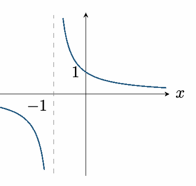
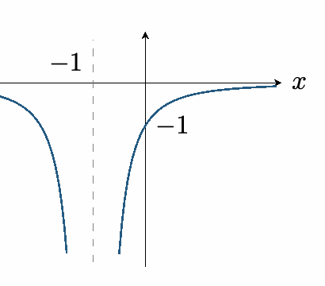
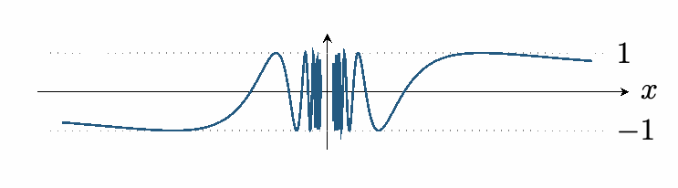
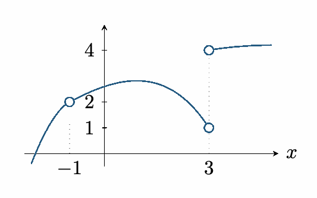
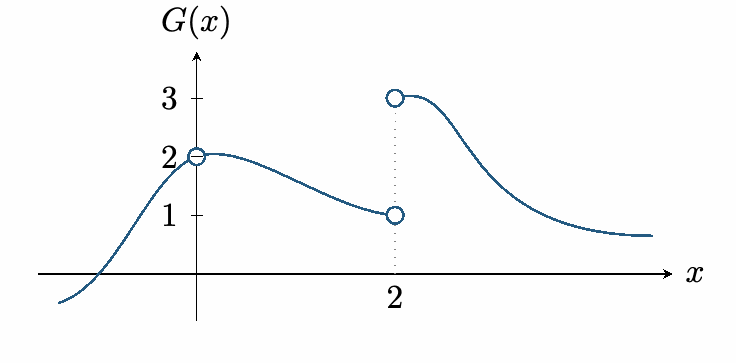
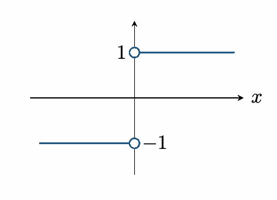

::: {.source-note}
[Lecture PDF · September 28, 2026](../downloads/september-28-limits-class-notes.pdf)
:::

## Infinite limits and vertical asymptotes

**Definition.** We write $\displaystyle\lim_{x\to a}f(x)=\infty$ if outputs exceed every positive bound for all sufficiently nearby $x\ne a$.

We write $\displaystyle\lim_{x\to a}f(x)=-\infty$ if outputs fall below every negative bound for all sufficiently nearby $x\ne a$.

Similarly for $x\to a^-$ and $x\to a^+$. Infinity describes unbounded behavior; it is not a real-number limit.

The line $x=a$ is a *vertical asymptote* if at least one of the one-sided limits at $a$ is $\infty$ or $-\infty$.

**Example 1.** $\displaystyle A(x)=\frac{1}{x+1},\qquad a=-1.$

$$
\begin{gathered}
\lim_{x\to-1^-}A(x)=-\infty,\\[0.4em]
\lim_{x\to-1^+}A(x)=\infty.
\end{gathered}
$$

The two-sided limit DNE. The line $x=-1$ is a vertical asymptote.

{fig-alt="One over x plus 1 approaches negative infinity from the left of -1 and positive infinity from the right." width=206}

**Example 2.** $\displaystyle B(x)=\frac{-1}{(x+1)^2}.$

$$
\begin{gathered}
\lim_{x\to-1^-}B(x)=-\infty,\\[0.4em]
\lim_{x\to-1^+}B(x)=-\infty.
\end{gathered}
$$

Both sides have the same unbounded behavior:

$$
\lim_{x\to-1}B(x)=-\infty.
$$

Again, $x=-1$ is a vertical asymptote.

{fig-alt="Negative one over (x plus 1) squared approaches negative infinity from both sides of -1." width=209}

**Theorem.** For a positive even integer $n$,

$$
\lim_{x\to a}\frac{1}{(x-a)^n}=\infty.
$$

For a positive odd integer $n$,

$$
\begin{gathered}
\lim_{x\to a^-}\frac{1}{(x-a)^n}=-\infty,
\\[0.4em]
\lim_{x\to a^+}\frac{1}{(x-a)^n}=\infty.
\end{gathered}
$$

## Harder limits

**1.** Find $\displaystyle\lim_{x\to0}\frac{x-1}{x^2(x+1)}$.

*Case method.* For $x$ sufficiently close to $0$, $x-1<0$, $x+1>0$, and $x^2>0$ when $x\ne0$. The numerator approaches $-1$ and the denominator approaches $0$ through positive values on both sides. Hence

$$
\begin{gathered}
\lim_{x\to0^-}\frac{x-1}{x^2(x+1)}=-\infty,
\\[0.4em]
\lim_{x\to0^+}\frac{x-1}{x^2(x+1)}=-\infty,
\end{gathered}
$$

so $\displaystyle\lim_{x\to0}\frac{x-1}{x^2(x+1)}=-\infty$.

**2.** Find $\displaystyle\lim_{x\to0}\frac{\sin x}{x}$, with $x$ in radians.

*Table method.* Numerical values help suggest the answer here.

$$
\begin{array}{c|ccc}
x&\pm0.1&\pm0.01&\pm0.001\\\hline
\sin x/x&0.998334&0.999983&1.000000
\end{array}
$$

The entries are rounded to six decimal places. Taking $x_n=1/n$ and $x_n=-1/n$ suggests the same value from both sides:

$$
\lim_{x\to0}\frac{\sin x}{x}=1.
$$

This table suggests the result; a proof can be given using the squeeze theorem.

**3.** Find $\displaystyle\lim_{x\to0}\sin(1/x)$.

*Graph method.* The function keeps oscillating between $-1$ and $1$. For positive integers $n$, let

$$
x_n=\frac{1}{\pi/2+2\pi n},\qquad y_n=\frac{1}{3\pi/2+2\pi n}.
$$

Both approach $0$, but $\sin(1/x_n)=1$ and $\sin(1/y_n)=-1$. Therefore the limit DNE.

{fig-alt="Sine of one over x oscillates between -1 and 1 increasingly rapidly near zero." width=379}

## Limits to graphs

Construct a graph with the following properties:

$$
\lim_{x\to-1}u(x)=2,\qquad\lim_{x\to3^-}u(x)=1,
$$

$$
\lim_{x\to3^+}u(x)=4,\qquad u(3)\text{ undefined}.
$$

One possible graph is shown. A hole at $x=-1$ is allowed but not required.

{fig-alt="A curve approaches height 2 at x=-1 and height 1 from the left of x=3; the right branch approaches height 4 at x=3." width=272}

## Practice

**1.** Let $\displaystyle F(x)=\frac{-2}{(x-1)^3}$. Find $\displaystyle\lim_{x\to1}F(x)$.

*Case method.* Since the power is odd,

$$
\begin{gathered}
\lim_{x\to1^-}\frac{1}{(x-1)^3}=-\infty,
\\[0.4em]
\lim_{x\to1^+}\frac{1}{(x-1)^3}=\infty.
\end{gathered}
$$

Multiplication by $-2$ reverses the signs:

$$
\lim_{x\to1^-}F(x)=\infty,\qquad\lim_{x\to1^+}F(x)=-\infty.
$$

Therefore $\displaystyle\lim_{x\to1}F(x)$ DNE.

**2.** Construct a graph satisfying

$$
\begin{gathered}
\lim_{x\to0}G(x)=2,\\[0.4em]
\lim_{x\to2^-}G(x)=1,\\[0.4em]
\lim_{x\to2^+}G(x)=3,
\end{gathered}
$$

with $G(2)$ undefined.

*Solution.* One possible graph is shown below. Its left branch approaches height $1$ at $x=2$; its right branch approaches height $3$. Neither endpoint at $x=2$ is included.

{fig-alt="The graph approaches 2 at x=0, 1 from the left of x=2, and 3 from the right of x=2." width=376}

The hole at $(0,2)$ is optional: the condition at $0$ specifies a limit, not a function value.

**3. True or false.** If $\displaystyle\lim_{x\to a}f(x)$ DNE, then the function approaches $\infty$ or $-\infty$.

*Solution.* False. For example,

$$
f(x)=\begin{cases}1,&x>0,\\-1,&x<0.\end{cases}
$$

At $a=0$, the left-hand limit is $-1$ and the right-hand limit is $1$. The two-sided limit DNE, yet the function remains bounded.

{fig-alt="Two horizontal branches at heights -1 and 1 show a bounded function with no limit at zero." width=235}
