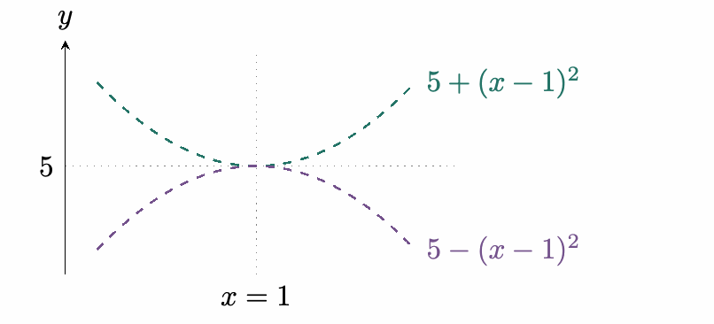
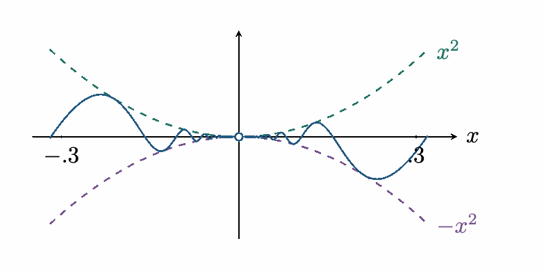
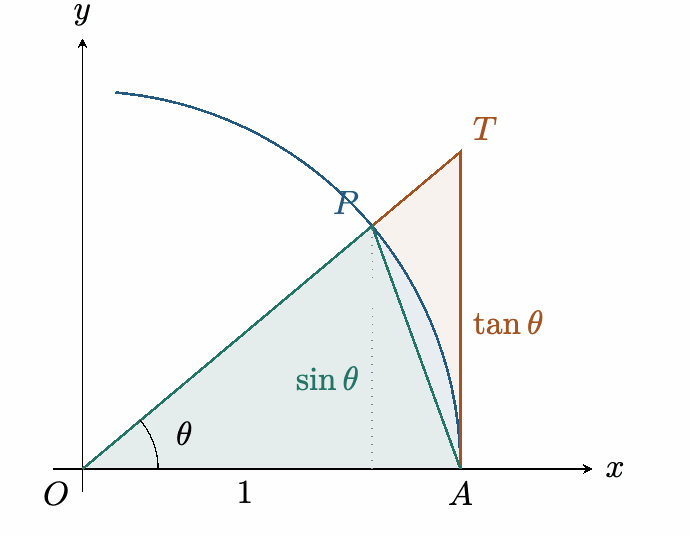

::: {.source-note}
[Lecture PDF · September 30, 2026](../downloads/september-30-revised-class-notes.pdf)
:::

## The squeeze theorem

::: {.statement}

**Squeeze theorem**

Suppose $\ell(x)\le f(x)\le u(x)$ for all sufficiently nearby $x\ne a$. If

$$
\lim_{x\to a}\ell(x)=\lim_{x\to a}u(x)=L,
$$

then $\displaystyle\lim_{x\to a}f(x)=L$.

:::

**Example 1.** Suppose

$$
5-(x-1)^2\le f(x)\le5+(x-1)^2
$$

near $x=1$.

*Squeeze theorem.* The lower and upper bounds both tend to $5$ as $x\to1$. Hence

$$
\lim_{x\to1}f(x)=5.
$$

{fig-alt="The functions 5 minus (x minus 1) squared and 5 plus (x minus 1) squared squeeze the shaded region to height 5 at x=1." width=411}

The shaded region contains all permitted values of $f(x)$.

**Example 2.** Find $\displaystyle\lim_{x\to0}x^2\sin(1/x)$.

*Squeeze theorem.* Since $-1\le\sin(1/x)\le1$ and $x^2\ge0$,

$$
-x^2\le x^2\sin(1/x)\le x^2\qquad(x\ne0).
$$

Both outer functions tend to $0$, so

$$
\lim_{x\to0}x^2\sin(1/x)=0.
$$

{fig-alt="The oscillating function x squared times sine of one over x lies between negative x squared and x squared." width=401}

The oscillations remain between bounds that both approach $0$.

## Trigonometric limits

**Example 3.** Find $\displaystyle\lim_{x\to0}\frac{\sin(5x)}{2x}$.

Recall $\displaystyle\lim_{u\to0}\frac{\sin u}{u}=1$; its proof follows in [the proof of the fundamental trigonometric limit](05-squeeze-theorem.qmd#the-fundamental-trigonometric-limit). Angles are measured in radians.

*Match the argument.* Use $u=5x$, so $u\to0$ as $x\to0$:

$$
\begin{aligned}
\lim_{x\to0}\frac{\sin(5x)}{2x}
 &=\frac52\lim_{x\to0}\frac{\sin(5x)}{5x}\\
 &=\frac52\lim_{u\to0}\frac{\sin u}{u}\\
 &=\frac52.
\end{aligned}
$$

## Difficult

$$
\lim_{x\to0}\frac{1-\cos x}{x}
$$

*Conjugate.* Multiply by $(1+\cos x)/(1+\cos x)$:

$$
\begin{aligned}
\frac{1-\cos x}{x}
 &=\frac{(1-\cos x)(1+\cos x)}{x(1+\cos x)}\\
 &=\frac{1-\cos^2x}{x(1+\cos x)}\\
 &=\frac{\sin^2x}{x(1+\cos x)}\\
 &=\frac{\sin x}{x}\cdot\frac{\sin x}{1+\cos x}.
\end{aligned}
$$

Using the trigonometric limits established in the following proof,

$$
\frac{\sin x}{x}\to1,\qquad\sin x\to0,\qquad1+\cos x\to2.
$$

Therefore

$$
\lim_{x\to0}\frac{1-\cos x}{x}=1\cdot\frac02=0.
$$

## The fundamental trigonometric limit

::: {.statement}

**Theorem**

For angles measured in radians,

$$
\lim_{\theta\to0}\frac{\sin\theta}{\theta}=1.
$$

:::

Proof

First suppose $0<\theta<\pi/2$. On the unit circle, let $O=(0,0)$, $A=(1,0)$, and $P=(\cos\theta,\sin\theta)$. The ray $OP$ meets the line $x=1$ at $T=(1,\tan\theta)$.

{fig-alt="A triangle inside a unit-circle sector and a larger tangent triangle bound the sector area." width=352}

Comparing the areas of triangle $OAP$, sector $OAP$, and triangle $OAT$ gives

$$
\frac12\sin\theta\le\frac12\theta\le\frac12\tan\theta,
\qquad\text{so}\qquad\sin\theta\le\theta\le\tan\theta.
$$

Since $0\le\sin\theta\le\theta$, we have $\sin\theta\to0$ as $\theta\to0^+$. Odd symmetry gives the left limit. Near $0$, cosine is positive, so

$$
\begin{aligned}
\lim_{\theta\to0}\cos\theta
&=\lim_{\theta\to0}\sqrt{1-\sin^2\theta}=1.
\end{aligned}
$$

Now take reciprocals of the positive quantities in $\sin\theta\le\theta\le\tan\theta$, then multiply by $\sin\theta$:

$$
\begin{gathered}
\frac{\cos\theta}{\sin\theta}\le\frac1\theta\le\frac1{\sin\theta}\\
\Longrightarrow\quad
\cos\theta\le\frac{\sin\theta}{\theta}\le1.
\end{gathered}
$$

Both bounds approach $1$, so the squeeze theorem gives

$$
\lim_{\theta\to0^+}\frac{\sin\theta}{\theta}=1.
$$

For the left-hand limit, put $u=-\theta$. Then $u\to0^+$ and

$$
\begin{aligned}
\lim_{\theta\to0^-}\frac{\sin\theta}{\theta}
&=\lim_{u\to0^+}\frac{\sin(-u)}{-u}\\
&=\lim_{u\to0^+}\frac{\sin u}{u}=1.
\end{aligned}
$$

The two one-sided limits agree, proving the theorem.

