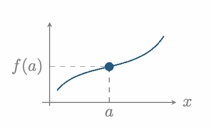
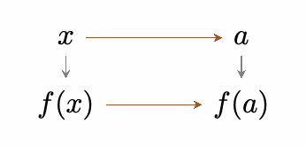
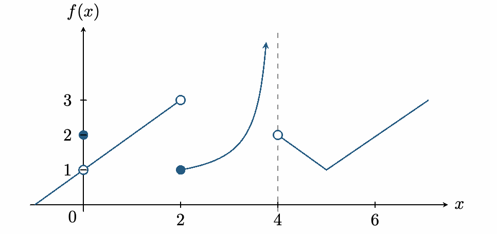

::: {.source-note}
[Lecture PDF · October 2, 2026](../downloads/october-2-continuity-class-notes.pdf)
:::

## Continuity at a point

::: {.statement}

**Definition**

A function $f$ is *continuous at $a$* if

$$
\lim_{x\to a}f(x)=f(a).
$$

:::

Check three things:

1.  $f(a)$ is defined.

2.  $\displaystyle\lim_{x\to a}f(x)$ exists as a finite number.

3.  $\displaystyle\lim_{x\to a}f(x)=f(a)$.

Graphically: the graph has no break at $a$.

{fig-alt="A continuous curve passes through the filled point (a,f(a))." width=216}

Algebraically: the plug-in rule works at $a$.

{fig-alt="As x approaches a, f(x) approaches f(a)." width=177}

**Example 1.** Is $f$ continuous at $a=-\tfrac12$?

$$
f(x)=\begin{cases}
\dfrac{6x^2-x-2}{2x+1},&x\ne-\tfrac12,\\
-3,&x=-\tfrac12.
\end{cases}
$$

*Check the value and the limit.* We have $f(-\tfrac12)=-3$. For $x\ne-\tfrac12$,

$$
\begin{aligned}
\frac{6x^2-x-2}{2x+1}
&=\frac{(2x+1)(3x-2)}{2x+1}=3x-2.
\end{aligned}
$$

Hence

$$
\lim_{x\to-1/2}f(x)=3\left(-\frac12\right)-2=-\frac72\ne-3.
$$

Therefore $f$ is not continuous at $x=-\tfrac12$.

::: {.statement}

**Corollary**

Polynomials and rational functions are continuous on their domains.

:::

Proof

Immediate from the plug-in rule.

## Types of discontinuities

::: {.statement}

**Definition**

A *removable discontinuity* at $a$ occurs when the finite limit $\displaystyle\lim_{x\to a}f(x)$ exists, but $f(a)$ is undefined or differs from that limit.

:::

::: {.statement}

**Definition**

A *jump discontinuity* at $a$ occurs when the two one-sided limits are finite and unequal.

:::

::: {.statement}

**Definition**

An *infinite discontinuity* at $a$ occurs when at least one one-sided limit is $+\infty$ or $-\infty$.

:::

**Example 2.** Classify the discontinuities in the graph.

{fig-alt="A removable discontinuity at x=0, a jump at x=2, and an infinite discontinuity at x=4." width=493}

   $x$  **Type**
  ----- -----------
   $0$  Removable
   $2$  Jump
   $4$  Infinite

## One-sided continuity

::: {.statement}

**Definition**

A function is *right-continuous at $a$* if $\displaystyle\lim_{x\to a^+}f(x)=f(a)$, and *left-continuous at $a$* if $\displaystyle\lim_{x\to a^-}f(x)=f(a)$.

:::

A function is continuous on an interval when it is continuous at every interior point (a point that is not an endpoint), with right-continuity at an included left endpoint and left-continuity at an included right endpoint.

**Example 3.** The function $f(x)=\sqrt{x}$ is continuous on $[0,\infty)$.

For $a>0$, the root law gives $\displaystyle\lim_{x\to a}\sqrt{x}=\sqrt{a}$. At the endpoint,

$$
\lim_{x\to0^+}\sqrt{x}=0=f(0),
$$

so $f$ is right-continuous at $0$.

## Problems: choosing constants for continuity

**1.** Find every $k\le5$ such that $H$ is continuous on $(-\infty,5]$:

$$
H(x)=\begin{cases}
3x+1,&x<k,\\
x-3,&k\le x\le5.
\end{cases}
$$

Show solution

*Match the pieces.* Each formula is continuous on its interval. At the joining point,

$$
\lim_{x\to k^-}H(x)=3k+1,
\qquad H(k)=k-3.
$$

For $k<5$, the right-hand limit is also $k-3$. Thus continuity requires

$$
\begin{aligned}
3k+1&=k-3,\\
2k&=-4,\\
k&=-2.
\end{aligned}
$$

The endpoint case $k=5$ would require the same equality for left-continuity, and does not satisfy it. With $k=-2$, the pieces match and $H$ is also left-continuous at $5$. Therefore the answer is $k=-2$.

**2.** Find all $m$ and $b$ that make $P$ continuous everywhere:

$$
P(x)=\begin{cases}
\dfrac{x^2-4}{x-2},&x<2,\\
b,&x=2,\\
mx-1,&x>2.
\end{cases}
$$

Show solution

*Match both limits and the value.* The only joining point is $x=2$.

$$
\begin{aligned}
\lim_{x\to2^-}P(x)
 &=\lim_{x\to2^-}\frac{(x-2)(x+2)}{x-2}
 =\lim_{x\to2^-}(x+2)=4,\\
\lim_{x\to2^+}P(x)&=2m-1,\\
P(2)&=b.
\end{aligned}
$$

Continuity requires all three quantities to agree:

$$
4=2m-1=b.
$$

Consequently,

$$
b=4,\qquad m=\frac52.
$$

With these choices, $P$ is continuous at $2$ and on each side of $2$.

## Operations that preserve continuity

::: {.statement}

**Proposition**

Suppose $f$ and $g$ are continuous on their domains. Then the following functions are continuous wherever they are defined:

$$
\begin{gathered}
f+g,\qquad f-g,\qquad cf,\qquad fg,\\[0.4em]
\frac fg,\qquad f^n,\qquad\sqrt[n]{f},
\end{gathered}
$$

where $c$ is a constant and $n$ is a positive integer. For a quotient, require $g(x)\ne0$; for an even root, require $f(x)\ge0$.

:::

Proof

For the sum, at a point $a$ in the common domain,

$$
\begin{aligned}
\lim_{x\to a}(f(x)+g(x))
 &=\lim_{x\to a}f(x)+\lim_{x\to a}g(x)\\
 &=f(a)+g(a)=(f+g)(a).
\end{aligned}
$$

The other statements follow from the corresponding limit laws, with limits taken within the domain.

## Continuity and composition

::: {.statement}

**Proposition**

Suppose $\displaystyle\lim_{x\to a}g(x)=L$ and $F$ is continuous at $L$. If $F(g(x))$ is defined for the nearby inputs under consideration, then

$$
\begin{aligned}
\lim_{x\to a}F(g(x))
&=F\left(\lim_{x\to a}g(x)\right)=F(L).
\end{aligned}
$$

:::

In particular, if $g$ is continuous at $a$ and $F$ is continuous at $g(a)$, then $F\circ g$ is continuous at $a$.

**Example 4.** Let $\displaystyle\lim_{x\to0}g(x)=-1$ and $F(x)=x^2-2x+1$.

*Composition.* Since $F$ is a polynomial, it is continuous at $-1$. Therefore

$$
\begin{aligned}
\lim_{x\to0}(F\circ g)(x)
 &=\lim_{x\to0}F(g(x))\\
 &=F\left(\lim_{x\to0}g(x)\right)\\
 &=F(-1)=1+2+1=4.
\end{aligned}
$$

## Continuity of the trigonometric functions

::: {.statement}

**Theorem**

The functions $\sin x$, $\cos x$, and $\tan x$ are continuous on their domains.

:::

::: {.statement}

**Lemma**

For angles measured in radians,

$$
\begin{gathered}
\lim_{h\to0}\sin h=0,
\\[0.4em]
\lim_{h\to0}\cos h=1.
\end{gathered}
$$

:::

Proof of the lemma

Using the limit $\displaystyle\lim_{h\to0}\frac{\sin h}{h}=1$ established previously,

$$
\begin{aligned}
\lim_{h\to0}\sin h
&=\lim_{h\to0}\left(h\frac{\sin h}{h}\right)=0\cdot1=0.
\end{aligned}
$$

Near $0$, cosine is positive. The identity $\cos^2h=1-\sin^2h$ and the root law give

$$
\begin{aligned}
\lim_{h\to0}\cos h
&=\lim_{h\to0}\sqrt{1-\sin^2h}=1.
\end{aligned}
$$

Proof of the theorem

**(i) Sine.** Fix $a\in\mathbb R$. Write $h=x-a$, so $h\to0$ as $x\to a$. By the angle-addition identity,

$$
\begin{aligned}
\lim_{x\to a}\sin x
 &=\lim_{x\to a}\sin\bigl((x-a)+a\bigr)\\
 &=\lim_{x\to a}\bigl(\sin(x-a)\cos a+\sin a\cos(x-a)\bigr)\\
 &=\cos a\lim_{h\to0}\sin h+\sin a\lim_{h\to0}\cos h\\
 &=\cos a\cdot0+\sin a\cdot1=\sin a.
\end{aligned}
$$

Thus sine is continuous at every real number $a$.

**(ii) Cosine.** Since $\cos x=\sin(x+\pi/2)$, sine continuity and composition give

$$
\begin{aligned}
\lim_{x\to a}\cos x
&=\lim_{x\to a}\sin(x+\pi/2)\\
&=\sin(a+\pi/2)=\cos a.
\end{aligned}
$$

Thus cosine is continuous at every real number $a$.

**(iii) Tangent.** If $a$ is in the domain of tangent, then $\cos a\ne0$. By the quotient law,

$$
\begin{aligned}
\lim_{x\to a}\tan x
&=\lim_{x\to a}\frac{\sin x}{\cos x}\\
&=\frac{\sin a}{\cos a}=\tan a.
\end{aligned}
$$

Thus tangent is continuous wherever it is defined.

