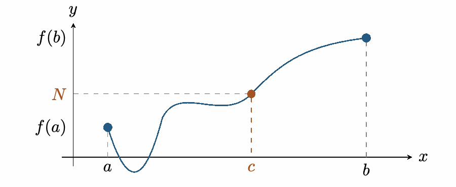

::: {.source-note}
[Lecture PDF · October 2, 2026](../downloads/october-2-continuity-class-notes.pdf)
:::

## The Intermediate Value Theorem

::: {.statement}

**Intermediate Value Theorem**

Suppose $f$ is continuous on $[a,b]$. If $N$ lies between $f(a)$ and $f(b)$, then there is a $c\in[a,b]$ such that

$$
f(c)=N.
$$

:::

{fig-alt="A continuous graph reaches the intermediate height N at a point c between a and b." width=459}

**Idea:** Continuous functions achieve their intermediate values.

**Example 5.** Does the equation $4x^3-6x^2+3x-2=0$ have a solution?

*Intermediate Value Theorem.* Let $f(x)=4x^3-6x^2+3x-2$. Since $f$ is a polynomial, it is continuous on $[0,2]$. Also,

$$
\begin{gathered}
f(0)=-2,
\\[0.4em]
f(2)=32-24+6-2=12.
\end{gathered}
$$

Because $-2<0<12$, the IVT guarantees a number $c\in(0,2)$ with $f(c)=0$. Thus the equation has a solution.

**Example 6.** You travel from home to campus from 7--8 a.m., then return home along the same path from 7--8 p.m. Must there be a clock time when you are at the same place during both trips?

*Intermediate Value Theorem.* Yes. Imagine the two trips happening simultaneously: one traveler starts at home and the other at campus. Their positions along the path vary continuously, and their order reverses by the end of the hour. The difference of their positions therefore changes sign. By the IVT, that difference must be zero sometime: they meet. This gives the same place at the same number of minutes after 7 on both trips.
