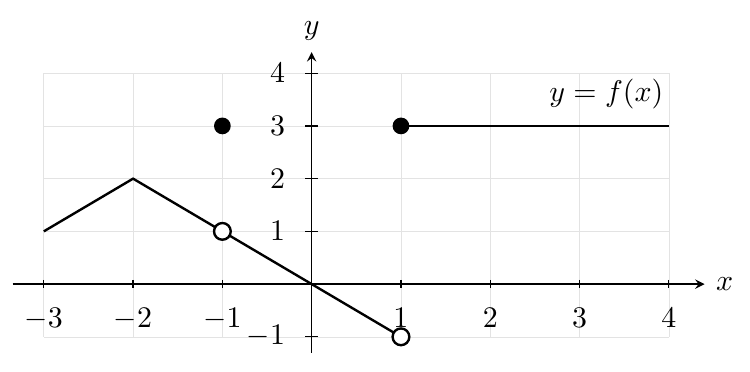
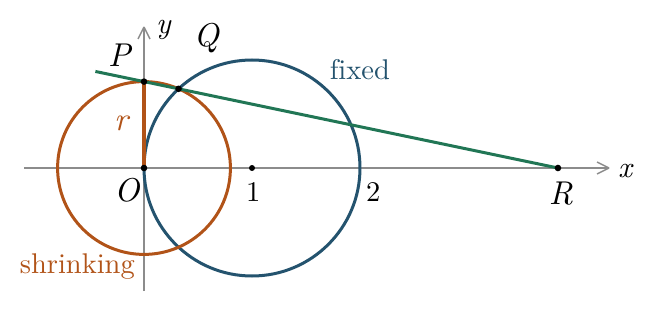

::: {.source-note}
Practice · October 5, 2026 · [Download the original four-page PDF](../downloads/october-5-exam-practice.pdf). No answers are included.
:::

**Limits and Continuity: In-Class Practice**

MATH 1334 · Monday, October 5, 2026

Show your work and explain your reasoning. Give exact answers; no calculator is needed. Use radians. For a limit, give a real number, $+\infty$, $-\infty$, or DNE, as appropriate. Use the review notes to decide what to revisit after your attempt.

## Problem 1

Use the graph below. Open circles are excluded points; filled circles give the function values.

{fig-alt="Graph of f: line segments join (-3,1), (-2,2), and an open point at (1,-1), with a hole at (-1,1) and a filled point at (-1,3). A horizontal segment at height 3 begins with a filled point at (1,3) and extends to x=4." width=500}

**(a)** Find $f(-1)$, $\displaystyle\lim_{x\to-1^-}f(x)$, and $\displaystyle\lim_{x\to-1^+}f(x)$. Is $f$ continuous at $-1$?

**(b)** Find $\displaystyle\lim_{x\to1^-}f(x)$ and $\displaystyle\lim_{x\to1^+}f(x)$. Can changing only $f(1)$ make $f$ continuous at $1$? Explain.

**(c)** Is $f$ continuous at $-2$? Explain why the corner does or does not matter.

*Review:* [Function values and one-sided limits](02-limits.qmd#limits-and-function-values), [continuity](06-continuity.qmd#continuity-at-a-point), and [discontinuities](06-continuity.qmd#types-of-discontinuities).

## Problem 2

Let $\displaystyle H(x)=\frac{-2}{(x+2)(x-1)^2}$.

**(a)** Find the left-hand, right-hand, and two-sided limits at $x=-2$.

**(b)** Find the left-hand, right-hand, and two-sided limits at $x=1$.

**(c)** Give all vertical asymptotes. Explain how the powers of the denominator's factors affect the signs in (a) and (b).

*Review:* [Sign analysis, infinite limits, and vertical asymptotes](03-infinite-limits.qmd#infinite-limits-and-vertical-asymptotes).

## Problem 3

Evaluate each limit. Choose a method and show the steps that justify it.

**(a)** $\displaystyle\lim_{x\to2}\frac{x^2+3}{x+1}$

**(b)** $\displaystyle\lim_{x\to3}\frac{x^2-2x-3}{x^2-9}$

**(c)** $\displaystyle\lim_{x\to0}\frac{\sqrt{4+x}-\sqrt{4-x}}{x}$

**(d)** $\displaystyle\lim_{x\to0}\frac{\dfrac{1}{1+x}-\dfrac{1}{1-x}}{x}$

*Review:* [Substitution and factoring](04-limit-laws.qmd#three-possibilities-when-we-substitute), [conjugates and common denominators](04-limit-laws.qmd#indeterminate-forms-and-simplifying).

## Problem 4

Evaluate each limit. Show the identity or fundamental limit you use.

**(a)** $\displaystyle\lim_{x\to0}\frac{\sin(3x)}{\sin(2x)}$

**(b)** $\displaystyle\lim_{x\to0}\frac{\tan(2x)}{3x}$

*Review:* [The fundamental sine limit](05-squeeze-theorem.qmd#the-fundamental-trigonometric-limit), [matching angles](05-squeeze-theorem.qmd#trigonometric-limits), and [the identity $\tan u=\sin u/\cos u$](04-limit-laws.qmd#indeterminate-forms-and-simplifying).

## Problem 5

Find all values of $a$, $b$, and $c$ that make $G$ continuous on $\mathbb R$. Write the continuity conditions at both $1$ and $3$, including the function value at each point.

$$
G(x)=\begin{cases}
x^2+1,&x<1,\\
ax+b,&1\le x<3,\\
c,&x=3,\\
2x,&x>3.
\end{cases}
$$

*Review:* [The three continuity conditions](06-continuity.qmd#continuity-at-a-point) and [matching pieces at their endpoints](06-continuity.qmd#problems-choosing-constants-for-continuity).

## Problem 6

Evaluate the following arguments. Explain what is correct or incorrect.

**(a)** A student says, “Substitution gives $0/0$, so the limit does not exist.” Give a specific example showing why this conclusion is not justified.

**(b)** Suppose $\displaystyle\lim_{x\to2^-}f(x)=\lim_{x\to2^+}f(x)=3$, but $f(2)=-1$. A student says, “The one-sided limits agree, so $f$ is continuous at $2$.” Identify the failed continuity condition and explain how to repair it.

*Review:* [Indeterminate forms](04-limit-laws.qmd#indeterminate-forms-and-simplifying) and [the difference between a limit and a function value](06-continuity.qmd#continuity-at-a-point).

## Problem 7

Sketch two continuous functions on $[-2,2]$, each with endpoint values $f(-2)=f(2)=3$: one with no zeros, and one with at least two zeros. What do positive endpoint values alone tell you about whether a continuous function has a zero inside the interval?

*Review:* [What the Intermediate Value Theorem guarantees about zeros](07-intermediate-value.qmd#the-intermediate-value-theorem).

## Problem 8

For $x\ne0$, let $q(x)=2+x\sin(1/x)$. Find $\displaystyle\lim_{x\to0}q(x)$ using the squeeze theorem. Give lower and upper bounds valid for both positive and negative $x$, and show their limits.

*Review:* [The squeeze theorem and bounds that hold on both sides of the limiting input](05-squeeze-theorem.qmd#the-squeeze-theorem).

## Problem 9

Show that $\cos x=x$ has at least one solution in $(0,\pi/2)$. Name the function to which you apply the Intermediate Value Theorem, verify its hypotheses, and state its conclusion. Does the IVT alone prove uniqueness?

*Review:* [The Intermediate Value Theorem, its hypotheses, and existence versus uniqueness](07-intermediate-value.qmd#the-intermediate-value-theorem).

## Problem 10: Where does the intercept go?

Keep the circle $(x-1)^2+y^2=1$ fixed while the circle $x^2+y^2=r^2$ shrinks toward $O=(0,0)$, with $0<r<1$. Let $P=(0,r)$, let $Q$ be the upper intersection of the circles, and let $R=(a(r),0)$ be the $x$-intercept of the line through $P$ and $Q$.

{fig-alt="A fixed blue circle centered at (1,0) and a shrinking orange circle centered at O intersect at Q above the x-axis. P is the top of the shrinking circle, at height r. The green line through P and Q meets the positive x-axis at R, to the right of both circles." width=436}

**(a)** Sketch a smaller circle and its corresponding line $PQ$. Predict where $R$ goes as $r\to0^+$. Does it have to follow $P$ and $Q$ toward the origin?

**(b)** Find the coordinates of $Q$ in terms of $r$, then find $a(r)$.

Hint

Subtract the two circle equations before solving for the positive $y$-coordinate.

**(c)** Find $\displaystyle\lim_{r\to0^+}a(r)$ and justify your answer algebraically. Compare with your prediction. Why can you not determine the intercept by setting $r=0$ in the geometric construction at the outset?

*Review:* Circle equations, [slopes and intercepts](00-functions.qmd#slope-average-rate-of-change-and-lines); [conjugates and indeterminate forms](04-limit-laws.qmd#indeterminate-forms-and-simplifying).
